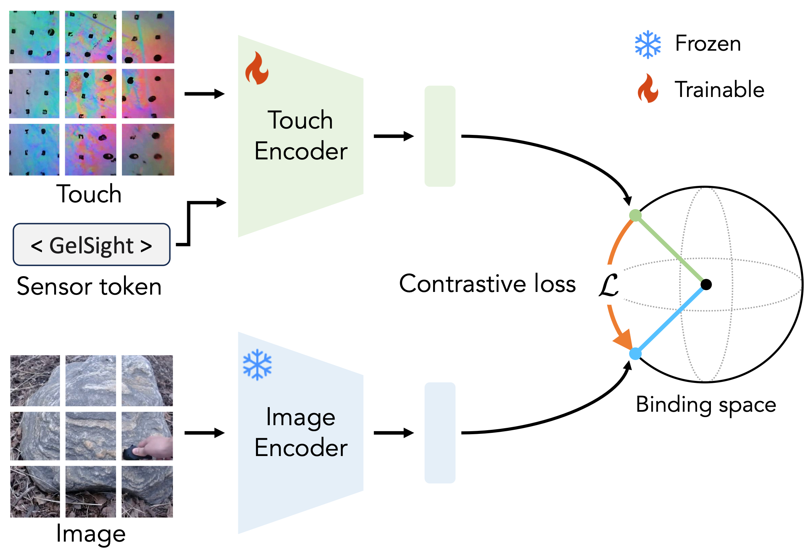

# Binding Touch to Everything: Learning Unified Multimodal Tactile Representations (CVPR 2024)
[](https://arxiv.org/abs/2401.18084)
[](https://huggingface.co/chfeng/Touch-LLM)
[](https://cfeng16.github.io/UniTouch/)

<hr style="border: 2px solid gray;"></hr>

This repo contains code of **Touch-LLM** for **UniTouch**.
Our code is built on top of the [ImageBind](https://github.com/facebookresearch/ImageBind) and [LLaMA-Adapter](https://github.com/OpenGVLab/LLaMA-Adapter) codebases.



# Inference with Pretrained Models

1. Download the pretrained touch encoder (`last_new.ckpt`) from the [HuggingFace model hub](https://huggingface.co/chfeng/Touch-LLM) and put it in the `./UniTouch` folder, same level as `touch_qa.py`.
2. Download the folder `ckpts` from the [HuggingFace model hub](https://huggingface.co/chfeng/Touch-LLM) and put it in the `./UniTouch` folder, same level as `touch_qa.py`.
3. Download the folder `llama_ori` from the [HuggingFace model hub](https://huggingface.co/chfeng/Touch-LLM) and put it in the `./UniTouch` folder, same level as `touch_qa.py`.


For Touch-LLM:
```bash
CUDA_VISIBLE_DEVICES=0 python touch_qa.py
```


## Citation

```bibtex
@inproceedings{yang2024binding,
  title={Binding touch to everything: Learning unified multimodal tactile representations},
  author={Yang, Fengyu and Feng, Chao and Chen, Ziyang and Park, Hyoungseob and Wang, Daniel and Dou, Yiming and Zeng, Ziyao and Chen, Xien and Gangopadhyay, Rit and Owens, Andrew and others},
  booktitle={Proceedings of the IEEE/CVF Conference on Computer Vision and Pattern Recognition},
  pages={26340--26353},
  year={2024}
}
```
